# Documentació del projecte
En aquest examen fem un repas a les diferents comandes vistes a clase

## INSTRUCCIONS

### 1- CONFIGURACIO INICIAL
  1. Comprova la versió instal·lada de Git, fes captura del terminal.
  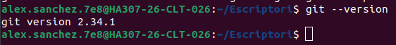
  2. Configura Git al teu sistema (opcional)
  
  3. Mostra la configuració actual per verificar-ho, fes captura del terminal. Explica com veig que he configurat correctament el email i el nom.
  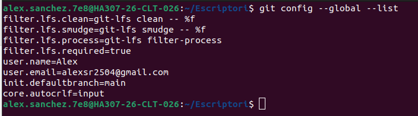
  4. Inicia un nou repositori Git al directori de treball on consideris. El nom del directorio ha de ser `Cognom1Cognom2Examen2425`
  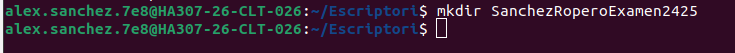
  5. Crea un document README.md, afegeix el document i fes un primer commit que amb el missatge
     `1 - Git init`
  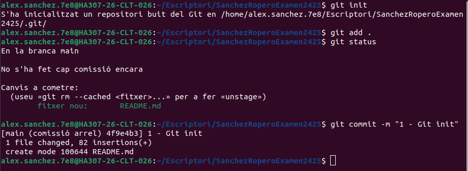

### 2- CREACIÓ DEL PROJECTE WEB
  1. Crea els fitxers següents al directori del projecte:
  `index.html`
  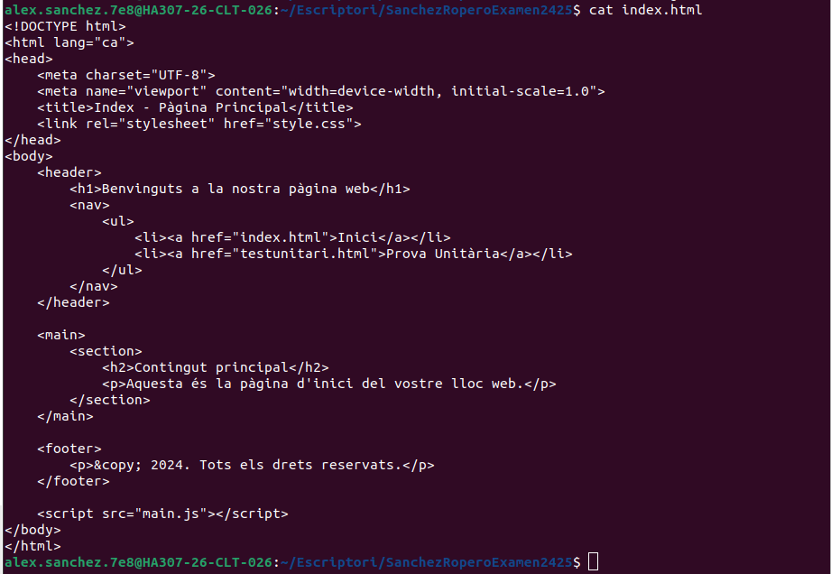
  `testunitari.html`
  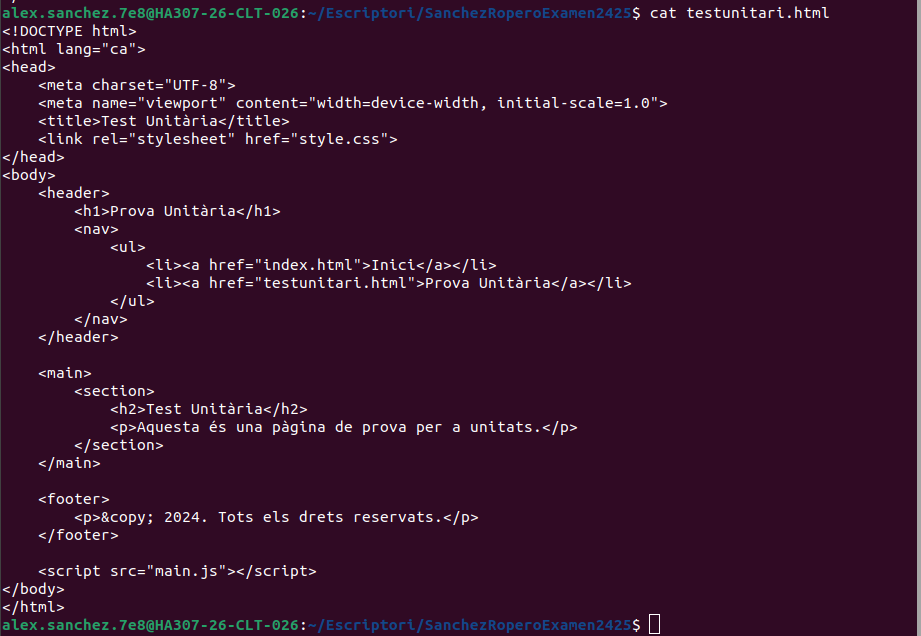
  `style.css`
  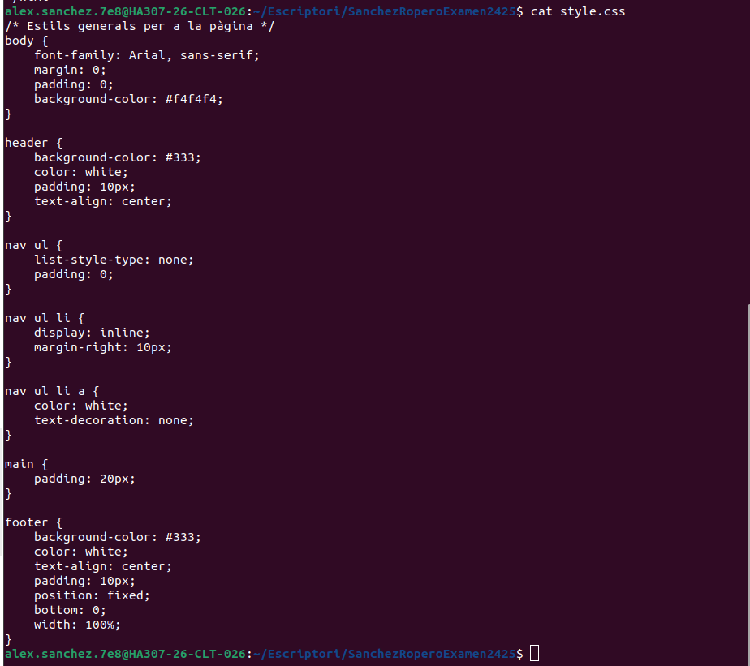
  `main.js`
  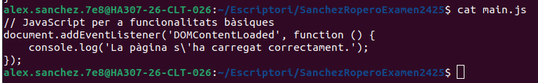

  2. Afegeix contingut bàsic a cada fitxer.

### 3- GESTIÓ AMB GIT
  1. Afegir fitxers:
     1. Utilitza un patró d'expressió regular per afegir tots els fitxers .html i .css. Fes captura del terminal
  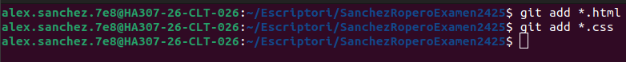
  3. Verifica l'estat del repositori, fes captura del terminal
  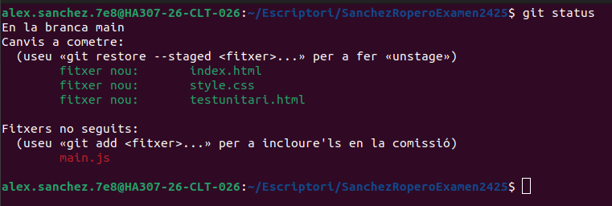
  
  4. Elimina testunitari.html del staging
  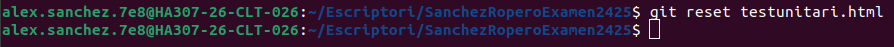
  
  5. Fes un commit que amb el missatge '2- Estructura bàsica'
  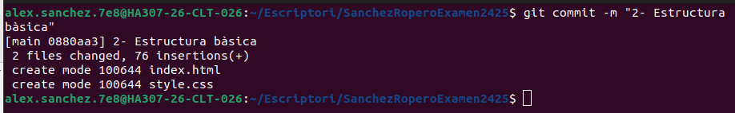
  
  6. Consulta l'historial de commits, fes captura del terminal.
  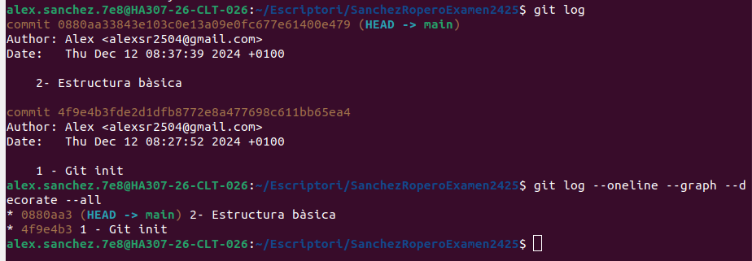

### 4- CREACIÓ DE BRANQUES I DOCUMENTACIÓ
  1. Crea una nova branca per a la documentació
  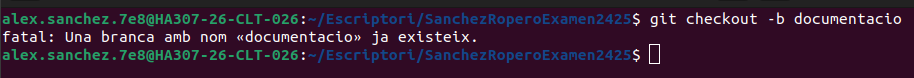

  2. Crea un fitxer README.md si es necessari:
     1. Explica dins del fitxer el propòsit del projecte.
  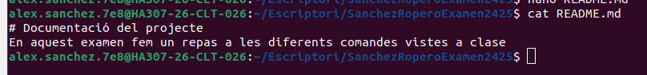
  
  3. Afegeix i fes commit dels canvis a la branca documentacio. El missatge del commit ha de ser "3 - README.md amb documentació inicial"
  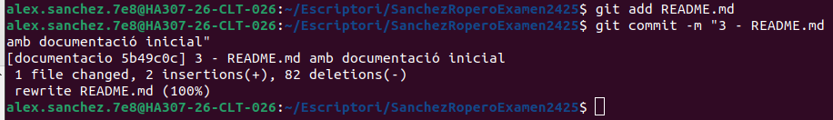
  
  4. Torna a la branca principal (main) i fes un merge
  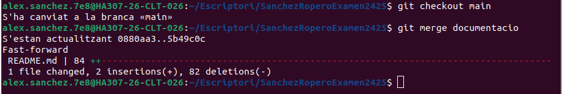

### 5- REMOT I PUBLICACIÓ
  1. Configura un remot per al repositori que has de crear en GitHub, el nom del repositorio de GitHub ha de ser Cognom1Cognom2Examen2425. Fes captura al terminal de com has configurat el repositori remot.
  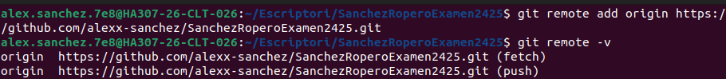

  2. Puja els canvis al remot desde terminal.Fes captura al terminal.
  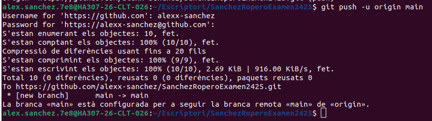
  
  3. Publica el projecte a Vercel i indica l'enllaç en el document Markdown del examen.
